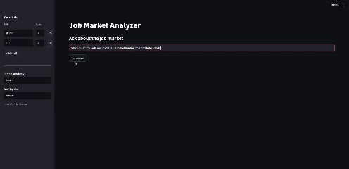
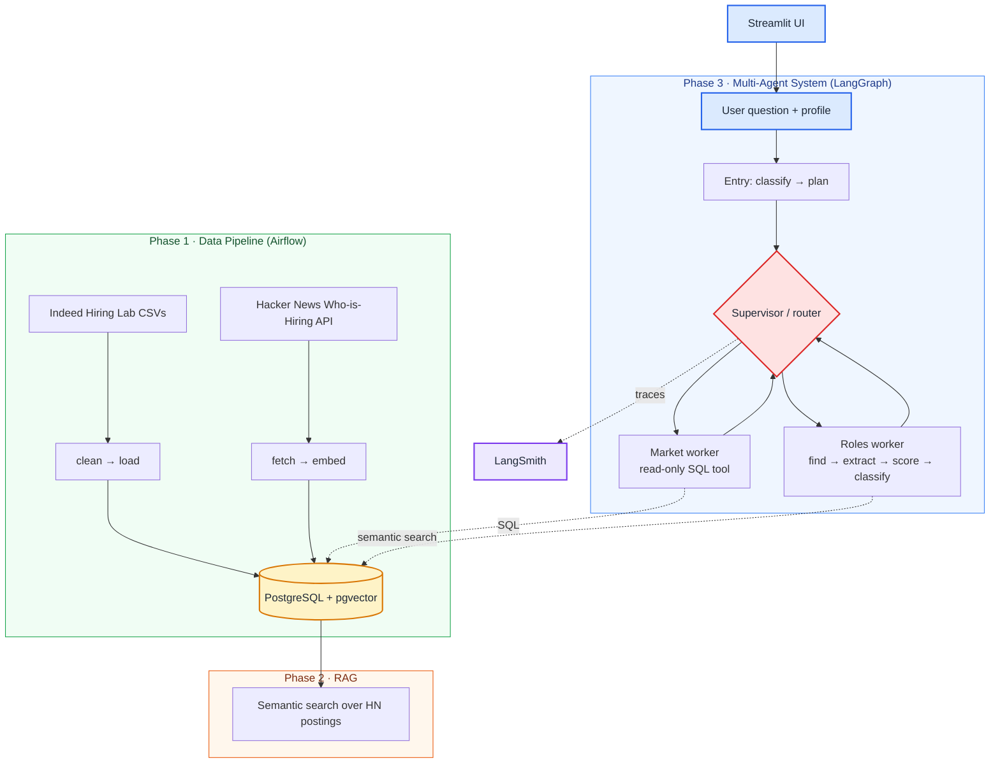

# Job Market Analyzer

[](https://github.com/can005/job-market-analyzer/actions/workflows/CI.yml)
[](https://www.python.org/downloads/)
[](LICENSE)
[](https://github.com/astral-sh/ruff)

An end-to-end AI engineering system that turns raw labor-market data into grounded answers and ranked job matches. It combines a batch **data pipeline**, a **RAG** layer with automated quality evaluation, a **multi-agent** reasoning system, and **observability** — wired together behind a Streamlit UI.

> Built to exercise the full AI-engineering stack: ingestion and orchestration, retrieval, agentic tool use, structured outputs, evaluation, and tracing — not just a single LLM call.

---

## Demo



---

## What it does

Given a candidate profile (skills with years, domain, logistics) and a free-text question, the system:

1. **Classifies the request** into one of three routes — market trends only, role matching only, or both.
2. **Answers market questions** by writing read-only SQL against an Indeed posting-index time series.
3. **Finds and ranks roles** by semantically searching real Hacker News "Who is Hiring" postings, extracting required skills, and scoring each posting against the profile on a weighted, anchored rubric.
4. **Traces every run** in LangSmith for debugging and cost/latency inspection.

---

## Architecture



The agent layer uses a **supervisor/worker** pattern: an entry node classifies the request into a plan, a pure-function router walks the plan and dispatches to the next unfilled worker, and workers write their results back to a typed `AgentState`. Failed workers are marked and skipped rather than retried, so a partial answer still returns.

---

## Evaluation

The eval splits along the two paths the system actually ships:

- **Retrieval** — does the vector store rank the right HN postings for a given question? Non-LLM metrics: **hit@k** and **MRR** at the same `k=25` the agent uses.
- **Ranking** — does the scorer assign the expected band to a known profile/posting pair? A **deterministic** band check (predicted vs expected) always runs; an optional **LLM judge** grades the rationale for rubric match and evidence grounding, catching right-band-via-hallucination cases.

Both run against a frozen 1,679-posting corpus (`tests/fixtures/eval/hn_corpus.json`), a 48-question set weighted 25 / 40 / 35 across `single_fact` / `multi_hop` / `distractor` (`tests/fixtures/eval/questions.json`), and 15 hand-curated scoring cases balanced 5 / 5 / 5 across `strong` / `moderate` / `weak` expected bands (`tests/fixtures/eval/scoring_cases.json`). The embedding and judge models are pinned per run, and a local cache (`data/eval/cache/`) skips re-embedding when nothing changed.

The judge is **pluggable** via `JUDGE_MODEL` (default `gpt-4o`; accepts `claude-*` with `ANTHROPIC_API_KEY`). Eval runs label which judge produced their results — scores from different judges aren't comparable as one yardstick.

### Baseline (scorer: gpt-4o-mini · judge: gpt-4o)

| Eval | Metric | Value |
|---|---|---|
| Retrieval | hit@25 (31 scored Qs; 17 distractors held aside) | 1.00 |
| Retrieval | MRR | 0.89 |
| Scoring (deterministic) | band accuracy (15 cases) | 0.93 |
| Reasoning (LLM judge) | mean rubric_match | 0.90 |
| Reasoning (LLM judge) | mean evidence_grounded | 0.92 |

### What the numbers say (and what they don't)

**Retrieval — 1.00 / 0.89.** Every gold posting appears in the top-25, and on average the first gold sits at rank ≈1.1. The 31 scored questions include 19 multi-hop cases that genuinely require ≥2 postings; the 17 distractors (with `gold_ids: []`) are held aside in the aggregate — they're the abstention-honesty path the scoring eval exercises, not a retriever metric. So 1.00 here means the retriever consistently surfaces *both* postings a multi-hop question needs, not the single-document factoid case where 1.00 is usually suspicious.

**Scoring — 0.93** with one informative miss:
- `SM05` (Apple Senior DevOps + a junior platform-engineer profile) was authored as a borderline moderate (~2.95 expected band total, 2.50 = moderate floor). The scorer landed at 2.42 → `weak`. Band-edge miss, not a structural failure — the case exists exactly to probe calibration near the floor.

**Reasoning — 0.90 / 0.92** with one flagged case:
- `SS05` (CLEAR Staff iOS) — judge marked rubric_match 0.75 / evidence_grounded 0.50 because the rationale didn't address seniority. CLEAR's posting is sparse on stack/seniority detail, so the scorer had little to work with. Real signal: when the posting is thin, the rationale degrades even when the band is right. The next iteration is sharpening the scoring prompt to address all four rubric dimensions even when the posting is sparse.

### Refinement loop — single pass vs broadened loop (scorer: gpt-4o-mini)

The roles worker is the one piece doing *dynamic orchestration*: when a pass returns too few strong matches, the supervisor re-dispatches it on a hard-coded broadening ladder (relax logistics → adjacent skills → larger `k` → reformulate), accumulating candidates and deduping by HN id, until one of three guards trips (3 strong found · 3 passes · 12 candidates). This measures whether broadening actually earns its extra calls on deliberately narrow profiles, against the single-pass (pass 0) baseline.

| Profile (narrow by design) | Pass 0 | Full loop | Δ relevant |
|---|---|---|---|
| Rust + embedded · onsite Berlin | 5 cands, 3 relevant (0 strong) | 3 passes → 11 cands, 6 relevant (0 strong) | **+3** |
| Python + React full-stack · remote US | 5 cands, 5 relevant (2 strong) | 3 passes → 9 cands, 9 relevant (3 strong) | **+4** |
| Haskell + type theory · remote EU | 1 cand, 1 relevant | 3 passes → 4 cands, 4 relevant | **+3** |

**What it says.** On every narrow profile the loop surfaces +3–4 more *relevant* (non-weak) postings than the first pass alone, and on the full-stack profile broadening lifts the strong count 2 → 3. Widening recalls matches a single query doesn't.

**What it costs.** Relaxing constraints also pulls in weaker candidates, so the mean band total dips slightly (e.g. 3.75 → 3.57) — recall up, raw-pool precision down. The weighted score still floats the strong/moderate postings to the top of the user-facing ranking, but the candidate pool gets noisier. All three ran the full three passes; only the full-stack profile reached the 3-strong good-enough threshold (and only on the final pass), so on the narrower two the count cap is what bounds the work — the corpus simply lacks 3 strong matches and the loop doesn't chase what isn't there.

**Run-to-run variance.** Unlike the retrieval/ranking evals, this path is *not* deterministic — the agent composes its own search queries and the scorer is an LLM, so the absolute counts move between runs (a separate run had the full-stack pass 0 at 0 strong, not 2). What's stable across runs is the **sign and rough size of the delta**: every profile gains +2–4 relevant postings from broadening. Profiles here are illustrative narrow inputs in `evals/refine_eval.py`, not gold-labeled like the question set.

### Reproduce

```bash
python -m evals.run           # retrieval + ranking quality
python -m evals.refine_eval   # refinement loop: pass 0 vs full loop, per profile
```

`evals.run` writes one JSON per run to `data/eval/results/` with run_id, embedding/judge model metadata, corpus hash, per-question + per-case results, and the summary metrics above. No CI gating — the eval is read for what its per-question failures reveal, not used as a pass/fail threshold. `evals.refine_eval` drives the real roles worker against the frozen eval collection and makes many live LLM calls.

---

## Tech stack

| Layer | Tools |
|---|---|
| Orchestration | Apache Airflow (Dockerized, LocalExecutor) |
| Storage | PostgreSQL 16 + `pgvector` |
| Retrieval | LangChain, `langchain-postgres` PGVector, OpenAI embeddings |
| Agents | LangGraph (supervisor/worker graph), structured outputs via Pydantic |
| Evaluation | Retrieval (hit@k, MRR) and scoring eval (deterministic band + pluggable LLM judge) |
| Observability | LangSmith tracing |
| Interface | Streamlit |
| Quality | pytest (unit / integration / e2e markers), Ruff, GitHub Actions CI |

---

## Data sources

- [Indeed Hiring Lab](https://github.com/hiring-lab/job_postings_tracker) job-posting indices (Creative Commons 4.0)
- Hacker News "Who is Hiring" via the public Algolia API

---

## Repository layout

```
core/         config, LLM factories, Pydantic schemas, env/profile validators
ingestion/    clean, load, DB access, HN fetch/embed
agents/       LangGraph graph, entry classifier, supervisor/router, market & roles workers, tools
evals/        retrieval eval (hit@k, MRR), scoring eval (deterministic + judge), runner
ui/           Streamlit app, profile form, results rendering
dags/         Airflow DAGs (Indeed pipeline, HN jobs)
tests/        unit / integration / e2e (pytest markers); fixtures/eval/ holds the frozen corpus and questions
scripts/      environment + service startup helpers
```

---

## How to run

### Prerequisites
- Docker + Docker Compose
- Python 3.11
- An OpenAI API key (and a LangSmith key if you want tracing)

### 1. Configure environment

Copy the example env file and fill in values:

```bash
cp .env.example .env   # then edit
```

Required variables:

```bash
# Data DB (read/write — used by the pipeline)
DB_USER=...
DB_PASSWORD=...
DB_HOST=localhost
DB_PORT=5433
DB_NAME=...

# Read-only role (used by the agent SQL tool)
RO_DB_USER=...
RO_DB_PASSWORD=...

# LLM
OPENAI_API_KEY=...

# Tracing (optional)
LANGSMITH_TRACING=true
LANGSMITH_API_KEY=...
LANGSMITH_PROJECT=job-market-analyzer

# Airflow
FERNET_KEY=...
```

### 2. Start services

```bash
bash scripts/start_services.sh
```

This brings up the pgvector database (`localhost:5433`) and the Airflow stack (`http://localhost:8080`).

### 3. Run the data pipeline

Trigger the `job_market_pipeline` and HN DAGs from the Airflow UI to populate the database and embed postings.

### 4. Launch the app

```bash
pip install -r requirements-base.txt -r requirements-ui.txt
pip install -e . --no-deps
streamlit run ui/app.py
```

---

## Testing

```bash
pytest                     # fast unit tests (default)
pytest -m integration      # requires a running pgvector DB on :5433
pytest -m e2e              # requires OPENAI_API_KEY; hits the LLM (slow)
```

CI runs Ruff linting and the default test suite on every push and pull request.

---

## Design notes

- **Read-only SQL by construction.** The agent's market tool runs only against a database role with no write grants; a single-statement / DDL-keyword guard is a second layer on top of that, not the primary defense.
- **Structured outputs everywhere.** Classification, skill extraction, and scoring all return validated Pydantic models, so malformed LLM output fails fast instead of propagating.
- **Calibrated scoring.** Each posting is scored on four anchored 0–5 dimensions (skills, per-skill seniority, domain, logistics), combined with explicit weights and mapped to strong/moderate/weak bands.
- **Graceful degradation.** A worker failure is recorded in state and skipped; the run still returns whatever the other worker produced, with an `ok` / `partial` status.

---

## Author

Carlos Novo — [LinkedIn](https://linkedin.com/in/carlosnovo-2)