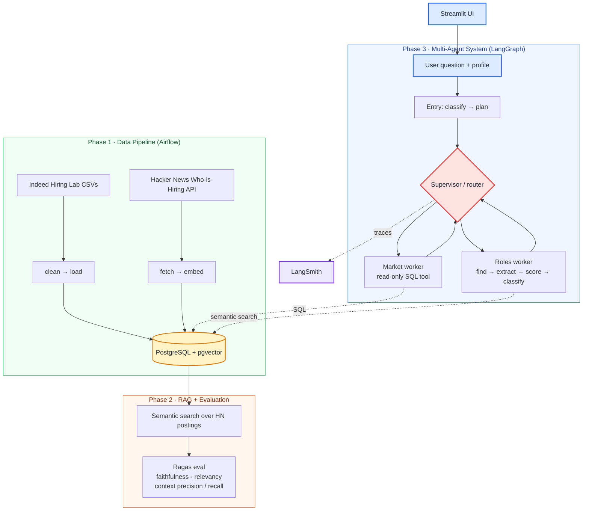
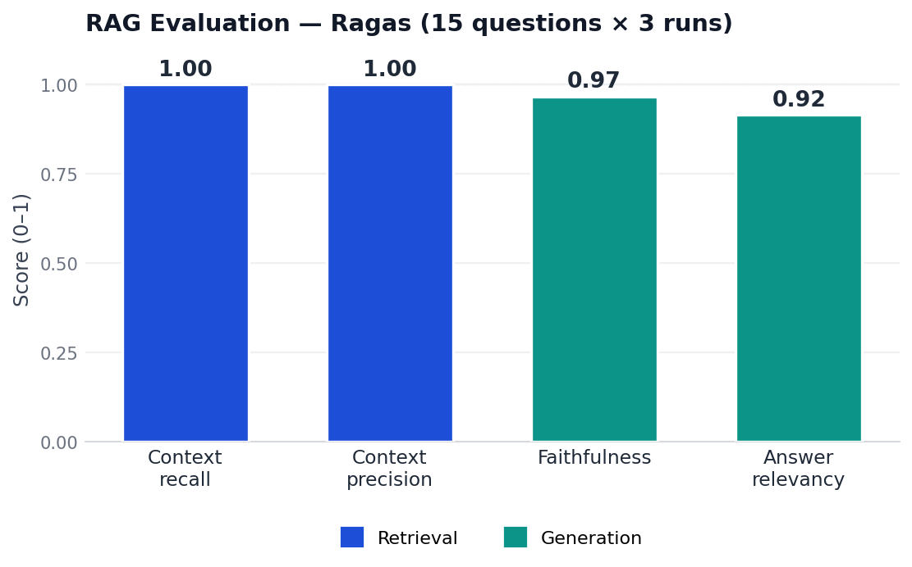

# Job Market Analyzer

[](https://github.com/can005/job-market-analyzer/actions/workflows/CI.yml)
[](https://www.python.org/downloads/)
[](LICENSE)
[](https://github.com/astral-sh/ruff)

An end-to-end AI engineering system that turns raw labor-market data into grounded answers and ranked job matches. It combines a batch **data pipeline**, a **RAG** layer with automated quality evaluation, a **multi-agent** reasoning system, and **observability** — wired together behind a Streamlit UI.

> Built to exercise the full AI-engineering stack: ingestion and orchestration, retrieval, agentic tool use, structured outputs, evaluation, and tracing — not just a single LLM call.

---

## What it does

Given a candidate profile (skills with years, domain, logistics) and a free-text question, the system:

1. **Classifies the request** into one of three routes — market trends only, role matching only, or both.
2. **Answers market questions** by writing read-only SQL against an Indeed posting-index time series.
3. **Finds and ranks roles** by semantically searching real Hacker News "Who is Hiring" postings, extracting required skills, and scoring each posting against the profile on a weighted, anchored rubric.
4. **Traces every run** in LangSmith for debugging and cost/latency inspection.

---

## Architecture



The agent layer uses a **supervisor/worker** pattern: an entry node classifies the request into a plan, a pure-function router walks the plan and dispatches to the next unfilled worker, and workers write their results back to a typed `AgentState`. Failed workers are marked and skipped rather than retried, so a partial answer still returns.

---

## RAG Evaluation

Retrieval and answer quality are measured with [Ragas](https://docs.ragas.io) over a 15-question reference set, averaged across 3 runs (45 evaluations).

| Metric            | Score |
|-------------------|-------|
| Context recall    | 1.00  |
| Context precision | 1.00  |
| Faithfulness      | 0.97  |
| Answer relevancy  | 0.92  |

Run-to-run variance is ≤ 0.002 on every metric, so the scores are reproducible rather than a single lucky run. Retrieval is near-perfect — the right postings are always found and irrelevant context stays out — and the small remaining headroom is in generation faithfulness on a few edge-case questions.

<details>
<summary>View chart</summary>



</details>

*Eval set: 15 questions over one corpus snapshot — directional, not a benchmark. Expanding coverage is tracked as future work.*

Reproduce with `python -m ingestion.evaluate`.

---

## Tech stack

| Layer | Tools |
|---|---|
| Orchestration | Apache Airflow (Dockerized, LocalExecutor) |
| Storage | PostgreSQL 16 + `pgvector` |
| Retrieval | LangChain, `langchain-postgres` PGVector, OpenAI embeddings |
| Agents | LangGraph (supervisor/worker graph), structured outputs via Pydantic |
| Evaluation | Ragas (faithfulness, response relevancy, context precision/recall) |
| Observability | LangSmith tracing |
| Interface | Streamlit |
| Quality | pytest (unit / integration / e2e markers), Ruff, GitHub Actions CI |

---

## Data sources

- [Indeed Hiring Lab](https://github.com/hiring-lab/job_postings_tracker) job-posting indices (Creative Commons 4.0)
- Hacker News "Who is Hiring" via the public Algolia API

---

## Repository layout

```
core/         config, LLM factories, Pydantic schemas, env/profile validators
ingestion/    clean, load, DB access, HN fetch/embed, RAG, Ragas evaluation
agents/       LangGraph graph, entry classifier, supervisor/router, market & roles workers, tools
ui/           Streamlit app, profile form, results rendering
dags/         Airflow DAGs (Indeed pipeline, HN jobs)
tests/        unit / integration / e2e (pytest markers)
scripts/      environment + service startup helpers
```

---

## How to run

### Prerequisites
- Docker + Docker Compose
- Python 3.11
- An OpenAI API key (and a LangSmith key if you want tracing)

### 1. Configure environment

Copy the example env file and fill in values:

```bash
cp .env.example .env   # then edit
```

Required variables:

```bash
# Data DB (read/write — used by the pipeline)
DB_USER=...
DB_PASSWORD=...
DB_HOST=localhost
DB_PORT=5433
DB_NAME=...

# Read-only role (used by the agent SQL tool)
RO_DB_USER=...
RO_DB_PASSWORD=...

# LLM
OPENAI_API_KEY=...

# Tracing (optional)
LANGSMITH_TRACING=true
LANGSMITH_API_KEY=...
LANGSMITH_PROJECT=job-market-analyzer

# Airflow
FERNET_KEY=...
```

### 2. Start services

```bash
bash scripts/start_services.sh
```

This brings up the pgvector database (`localhost:5433`) and the Airflow stack (`http://localhost:8080`).

### 3. Run the data pipeline

Trigger the `job_market_pipeline` and HN DAGs from the Airflow UI to populate the database and embed postings.

### 4. Launch the app

```bash
pip install -r requirements-base.txt -r requirements-ui.txt
pip install -e . --no-deps
streamlit run ui/app.py
```

---

## Testing

```bash
pytest                     # fast unit tests (default)
pytest -m integration      # requires a running pgvector DB on :5433
pytest -m e2e              # requires OPENAI_API_KEY; hits the LLM (slow)
```

CI runs Ruff linting and the default test suite on every push and pull request.

---

## Design notes

- **Read-only SQL by construction.** The agent's market tool runs only against a database role with no write grants; a single-statement / DDL-keyword guard is a second layer on top of that, not the primary defense.
- **Structured outputs everywhere.** Classification, skill extraction, and scoring all return validated Pydantic models, so malformed LLM output fails fast instead of propagating.
- **Calibrated scoring.** Each posting is scored on four anchored 0–5 dimensions (skills, per-skill seniority, domain, logistics), combined with explicit weights and mapped to strong/moderate/weak bands.
- **Graceful degradation.** A worker failure is recorded in state and skipped; the run still returns whatever the other worker produced, with an `ok` / `partial` status.

---

## Author

Carlos Novo — [LinkedIn](https://linkedin.com/in/carlosnovo-2)